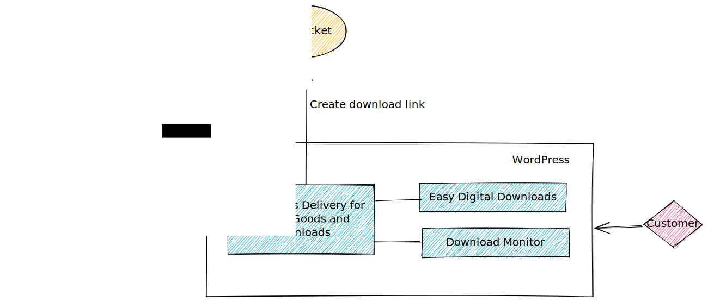

# Concept

*Continuous Delivery for Digital Goods and Downloads* uses AWS S3 (or a compatible S3 API) for storing and retrieving your downloadable artifacts.

As soon as the customer clicks on a EDD or DLM download, the plug-in generates a one-time S3 link.

