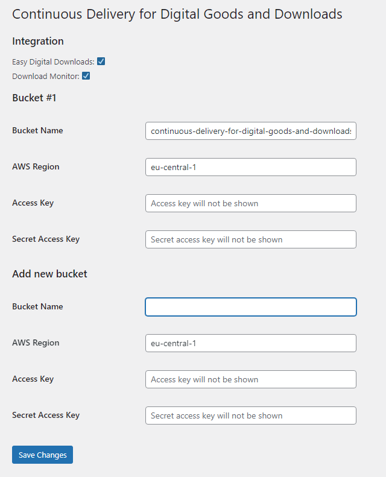

# Quick Start

*Continuous Delivery for Digital Goods and Downloads* requires minimal configuration efforts. After you have installed the plug-in, click on __Continuous Delivery__ in the left menu. You will be presented with the following configuration screen:

[Set up your AWS S3 bucket](configuration/storage/aws-s3) and paste in the following values:

| Settings | Value |
| --- | --- |
| __Bucket Name__ | `${BUCKET}` |
| __AWS Region__ | `${AWS_REGION}` |
| __Access Key__ | `${AWS_WORDPRESS_ACCESS_KEY}` |
| __Secret Access Key__ | `${AWS_WORDPRESS_SECRET_ACCESS_KEY}` |

Click on __Save Changes__.

Continue with
- [Setting up Download Monitor](configuration/wordpress/download-monitor)
- or [Setting up Easy Digital Downloads](configuration/wordpress/easy-digital-downloads)

and then [set up your Continuous Integration pipeline](configuration/continuous-integration/create-deployment-user).