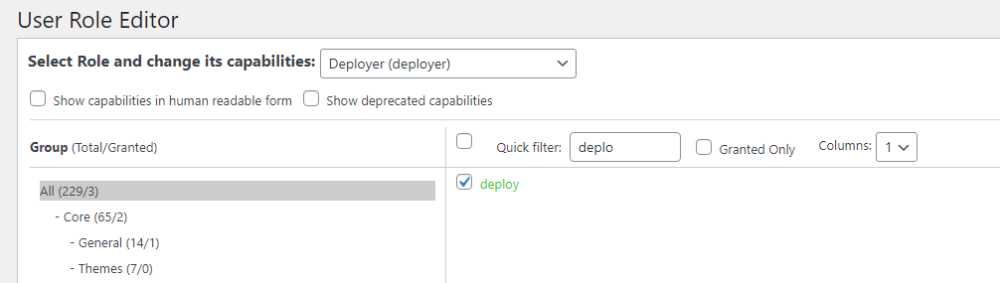
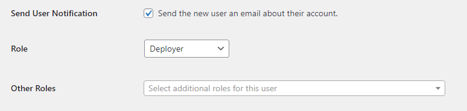
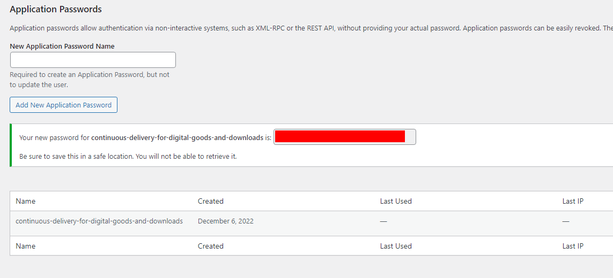

# Create a deployment user

To let your Continuous Integration pipeline connect to *Continuous Delivery for Digital Goods and Downloads*, you need a WordPress user with specific permissions and an application password. If you want to use another authentication method, check out [http://v2.wp-api.org/guide/authentication/](http://v2.wp-api.org/guide/authentication/).

:::tip
To keep things separated, you should create a new dedicated user for that task. Note down the user's name (`${WORDPRESS_DEPLOYER_USERNAME}`).
:::tip

## Required permissions
By default, *Continuous Delivery for Digital Goods and Downloads* requires that the user 

- has the username `admin`, `administrator` or `deployer`
- __or__ the user has the role `administrator` or `deployer`
- __or__ the user has the capability `manage_downloads` or `deploy`. `manage_downloads` is a capability from [Download Monitor](/configuration/wordpress/download-monitor).

### Adding a new role `deployer`
1. In WordPress, install the [User Role Editor plug-in](https://wordpress.org/plugins/user-role-editor/) and create a new role named `deployer`
2. Assign the permission `deploy` to the newly created role `deployer`:

	
  
3. Assign the role `deployer` to the user:

	

## Create an application password
Go to the user's profile and scroll down to __Application Passwords__. Choose a new __Application Password Name__ and click on __Add New Application Password__

Note down the password (`${WORDPRESS_DEPLOYER_APPLICATION_PASSWORD}`).