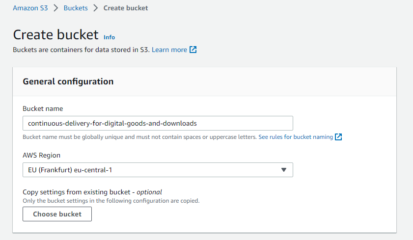
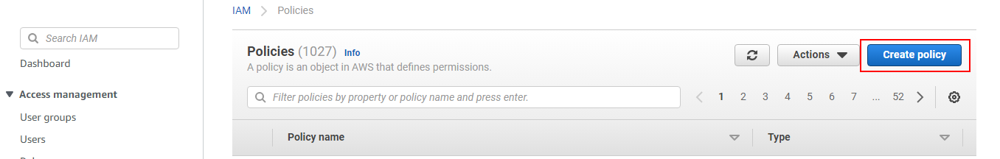
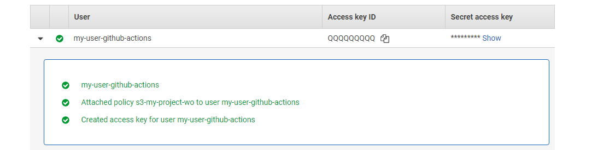
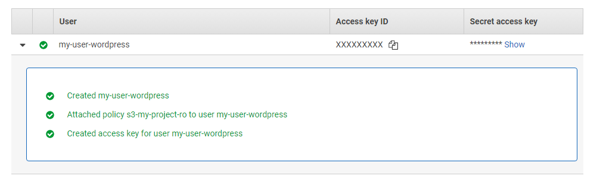

# AWS S3

To keep your delivery pipeline secured, we are setting up dedicated permissions for CI (write-only) and CD (read-only).

1. Create a new bucket (`${BUCKET}`) in AWS (__Amazon S3 > Buckets > Create Bucket). Note down the region (`${AWS_REGION}`).



2. In AWS, go to __IAM > Policies__ and use the button __Create policy__
	

3. Now create __two__ new policies:

	1. A __write-only__ policy used in your CI environment (`${IAM_POLICY_WRITE_ONLY}`) with the following JSON statement:
	
		```json
		{
			"Version": "2012-10-17",
			"Statement": [
				{
					"Effect": "Allow",
					"Action": [
						"s3:PutObject"
					],
					"Resource": [
						"arn:aws:s3:::${BUCKET}/*"
					]
				}
			]
		}
		```

	2. A __read-only__ policy used in WordPress (`${IAM_POLICY_READ_ONLY}`) with the following JSON statement:

		```json
		{
			"Version": "2012-10-17",
			"Statement": [
				{
					"Effect": "Allow",
					"Action": [
						"s3:GetObject"
					],
					"Resource": [
						"arn:aws:s3:::${BUCKET}/*"
					]
				}
			]
		}
		```

3. Go to __IAM > Users__ and create two new users with __programmatic access.:
	
	1. Create a user for your CI environment `${AWS_CI_USER_WRITE_ONLY}`. Attach the recently created IAM policy `${IAM_POLICY_WRITE_ONLY}` policy to it. 
	
	

	  Note down the __Access key ID__ (`${AWS_CI_ACCESS_KEY}`) and __Secret access key__ (`${AWS_CI_SECRET_ACCESS_KEY}`). 
	
	2. Create a user for WordPress `${AWS_WORDPRESS_USER_READ_ONLY}`. Attach the recently created IAM policy `${IAM_POLICY_READ_ONLY}` to it.
		
	
	
	Note down the __Access key ID__  (`${AWS_WORDPRESS_ACCESS_KEY}`) and __Secret access key__(`${AWS_WORDPRESS_SECRET_ACCESS_KEY}`).