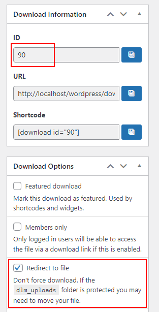

# Download Monitor

For using [Download Monitor](https://wordpress.org/plugins/download-monitor/), in WordPress go to __Downloads > `${YOUR_DOWNLOAD}` > Edit Download__. Note down the download's ID (`${WORDPRESS_PRODUCT_ID}`) in the right box and select the option __Redirect to file__.

Click on __Update__.

