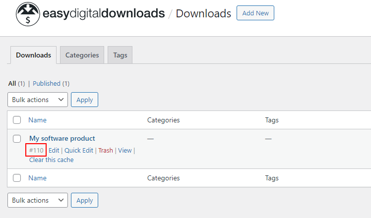

# Easy Digital Downloads

[Easy Digital Downloads](https://wordpress.org/plugins/easy-digital-downloads/) requires no further configuration.
In WordPress, go to __Downloads > Downloads__ and hover over your download in the list. Note down the download's ID (`${WORDPRESS_PRODUCT_ID}`).

